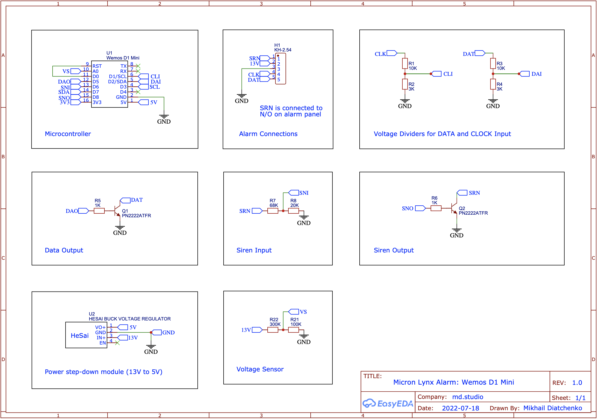
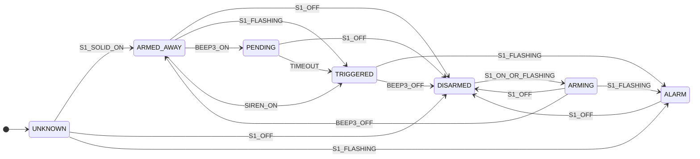
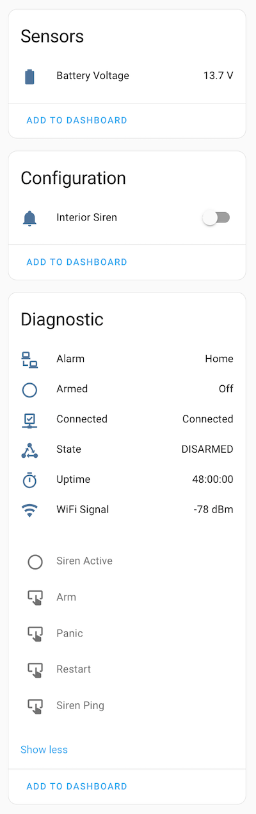

# ESPHome Micron Lynx Alarm

Control Micron Lynx alarm system from ESPHome. 

## Limitations

This integration provides connectiviy to the alarm panel only, but does not yet implement native [alarm_control_panel](https://esphome.io/components/alarm_control_panel/index.html). See "Example Usage" section below for options how to integrate it into Home Assistant.


## Schematic



[Schematic PDF](Schematic.pdf)


## Install

```yaml
external_components:
  - source:
      type: git
      url: https://github.com/muxa/esphome-micron-alarm

```

## Usage

```yaml
micron:
  clock_pin:
    number: D1
    inverted: true
  data_in_pin: 
    number: D2
    inverted: true
  data_out_pin: D5
  update_interval: 60s
  connected:
    name: "Alarm Connected"
  s1:
    name: "Alarm S1 Indicator"
  s2:
    name: "Alarm S2 Indicator"
  m:
    name: "Alarm M Indicator"
  beep1:
    name: "Alarm Beep 1"
  beep2:
    name: "Alarm Beep 2"
  beep3:
    name: "Alarm Beep 3"
  zone1:
    name: "Alarm Presence Living Room"
  zone2:
    name: "Alarm Presence Kitchen"
  zone3:
    name: "Alarm Presence Hallway"
  zone4:
    name: "Alarm Presence Bedrooom"
  zone5:
    name: "Alarm Presense Zone 5"
```

## Example Usage

To add the alarm to Home Assistant you have a couple of options:

### 1. Template Alarm control panel in HA

Use the [example-comfig.yaml](example-config.yaml). It uses a [state machine](https://github.com/muxa/esphome-state-machine)):



One you have the device connectest HA, add a [Template Alarm control panel in HA](https://www.home-assistant.io/integrations/alarm_control_panel.template/):

```yaml
alarm_control_panel:
  - platform: template
    panels:
      home_alarm:
        name: Home Alarm
        value_template: >
          
            disarmed
          
            arming
          
            armed_away
          
            pending
          
            triggered
          
            disarmed
          
            unavailable
          
        code_arm_required: false
        arm_away:
          service: esphome.alarm_arm_away
        disarm:
          service: esphome.alarm_disarm
          data:
            user_code: !secret alarm_code
```

With this configuration you'll have additional entities in Home Assistant:



### 2. Template Alarm Control Panel in ESPHome

Use [Template Alarm Control Panel in ESPHome](https://esphome.io/components/alarm_control_panel/template) and adapt [example-comfig.yaml](example-config.yaml) accordinly. 